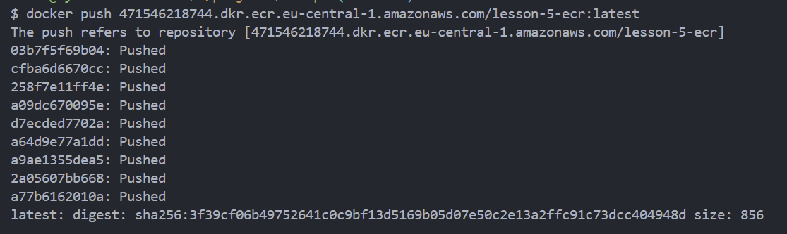
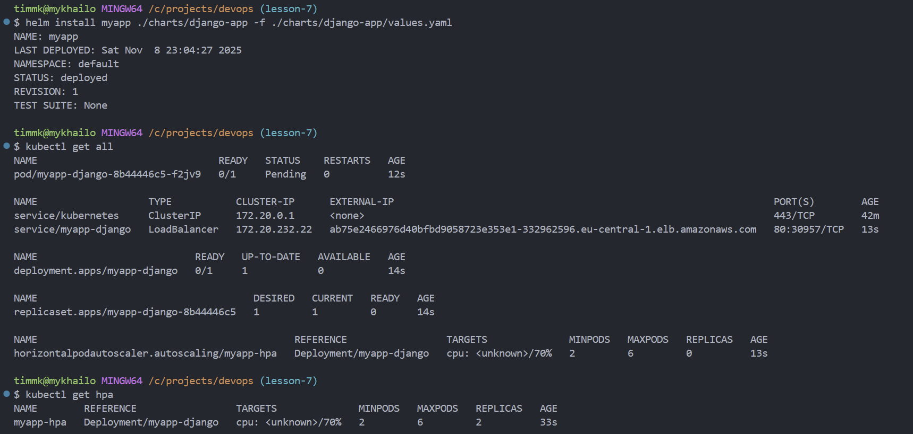

# lesson-7 — Kubernetes + Helm Deployment

## Опис

Проєкт розгортає Django-застосунок у Kubernetes (EKS) з використанням Helm:

- Створює EKS кластер у існуючій VPC
- Використовує ECR для зберігання Docker-образу
- Розгортає застосунок через Helm (Deployment, Service, HPA, ConfigMap)
- HPA масштабує кількість подів від 2 до 6 при навантаженні CPU > 70%
- Service типу LoadBalancer забезпечує зовнішній доступ

## Швидкий старт

1. Переконайтеся, що Docker-образ Django завантажено в ECR
2. Налаштуйте `kubectl` для доступу до EKS:
   ```bash
   aws eks update-kubeconfig --region eu-central-1 --name eks-cluster-lesson-7
   ```
3. Встановіть Helm chart:
   ```bash
   helm install myapp ./charts/django-app -f ./charts/django-app/values.yaml
   ```
4. Перевірка ресурсів:
   ```bash
   kubectl get all
   kubectl get hpa
   ```
5. Оновлення Helm chart:
   ```bash
   helm upgrade myapp ./charts/django-app -f ./charts/django-app/values.yaml
   ```
6. Видалення застосунку:
   ```bash
   helm uninstall myapp
   ```




# lesson-5 — Terraform (S3 backend, VPC, ECR)

## Опис

Проєкт створює:

- S3 бакет + DynamoDB таблицю для зберігання та блокування Terraform state
- VPC з 3 публічними та 3 приватними підмережами, IGW та NAT Gateway
- ECR репозиторій для Docker-образів

## Швидкий старт

1. Встановіть AWS CLI та налаштуйте `aws configure` (або export AWS credentials)
2. **Створіть S3 бакет перед `terraform init`** (деталі нижче)

### Варіант A — створити S3 бакет та DynamoDB вручну (через AWS CLI)

Створіть S3 бакет `aws s3 mb s3://terraform-state-bucket-mkuzich-1 --region eu-central-1` перед `terraform init`.

### Варіант B — bootstrap з локального бекенду

1. Тимчасово видаліть або закоментуйте `backend.tf` і запустіть `terraform init` для створення ресурсів (s3 + dynamodb)
2. Після створення бакету/таблиці — додайте `backend.tf` назад та перенастройте бекенд за допомогою `terraform init -reconfigure`

## Команди

`terraform init` - ініціалізація Terraform з бекендом S3
`terraform plan` - перегляд плану змін
`terraform apply` - застосування змін
`terraform destroy` - видалення створених ресурсів

## Важливо

- Імена бакетів S3 — глобально унікальні.
- Бекенд S3 повинен існувати до `terraform init`
- Переконайтесь, що у вашого IAM користувача/ролі є права для створення S3, DynamoDB, VPC, ECR, EC2 та EIP.
